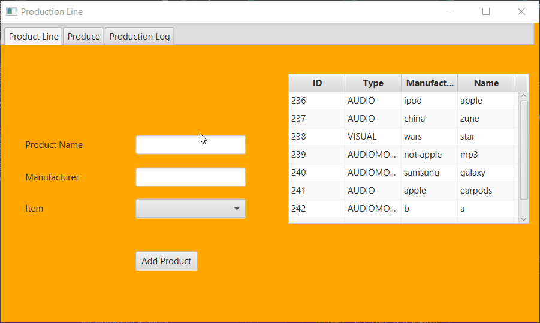
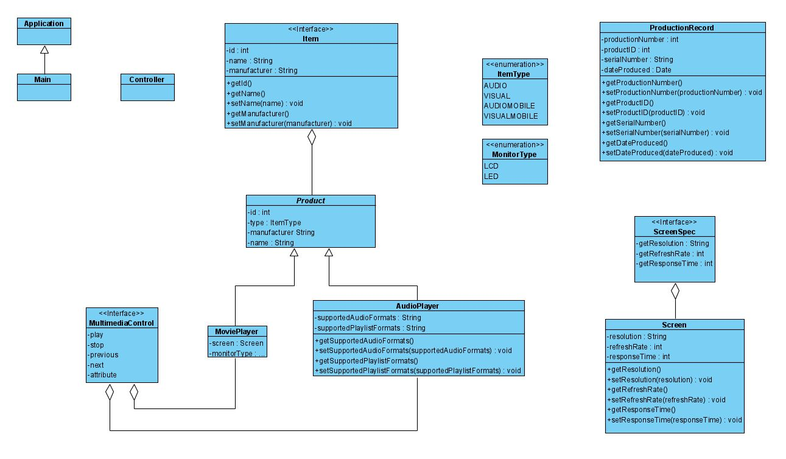

# Production

This JavaFX project allows users to add created products into a database for production. Once products have been created by the user  
they are entered into a production log available to the user. This was an individual project in which I received occasional help and  
guidance from the instructor or student assistants. I created this project as an assignment during the first semester of my junior year  
at Florida Gulf Coase University. Through it and other courses this semester, my knowledge and proficiency has greatly increased.

## Demonstration

 
or
https://i.imgur.com/aIe8mlv.gif

## Diagrams

## Built With

* IntelliJ IDEA 2020.2
* Gradle  
* Resources used: Oracle, Visual Paradigm (uml diagram) 

## Author

* Matthew Popescu

## License

Apache-2.0 License

## Acknowledgments

* Websites: Oracle, geeksforgeeks, tutorials.jenkov.com, 
* Professor Scott Vanselow
* SA/TA Andrew Cavallaro
* SA/TA Sean Lamont
